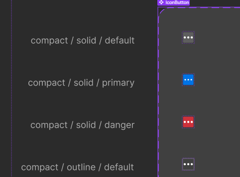

# Webflow

Custom Code
- the script id and the displayName are different names for the same thing 
- should be noted that its gets turned to lowercase
    - set a naming convention for the script id

Are you able to only create the meta data for the file you upload? 

- it seems that you can only add one custom script 
- I had to disable the cache for it to get the current script

- Initial load there is anti-aliasing problem

** the webpack npm script causes uncontrollable ts configuration. Also 

- there is a variant issue, the dots inside are not the same size

- It would be nice to have a forum for people creating the apps can ask questions and also ask. 

- There are issues with registering the page unless you have it be accessed through the docs api test sandbox

- width of the iframe doesnt really feel like is true to the pixel count

- Are you able to have more than 2000 charackters by having a hosted script? 

1. Embed Canvas
2. Upload Model 
3. Download Txt 

https://uploads-ssl.webflow.com/65137959d71c4c7e79fb350b/651621db463a304f3e09e873_boxTexture.txt

https://uploads-ssl.webflow.com/65137959d71c4c7e79fb350b/6514cb0e7132709cab5f645a_visceral3.txt